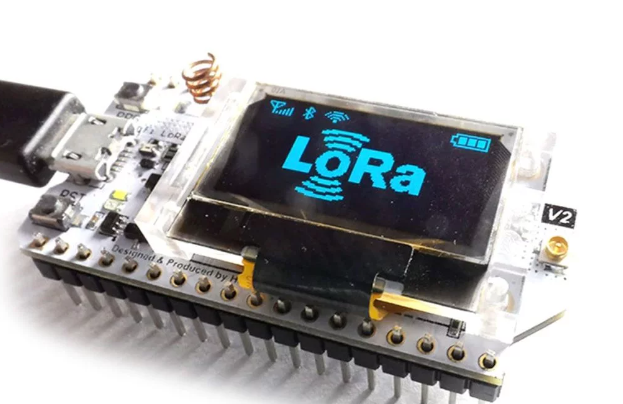

# Implementação de um sistema de sensoriamento embarcado com LoRa.

<p align="center">
  
</p>

Este repositório é dedicado ao desenvolvimento de uma rede IoT para sensoriamento, utilizando comunicação por radiofrequência LoRa (Long Range). O projeto envolve a implementação de um esquema estrela, no qual os elementos "gateway" - chamados de "receivers" no escopo do projeto - e os "end-devices" - chamados de "responders" no escopo do projeto - colaboram para coletar dados de sensores e encaminhá-los para um local host em HTTP Post - por intermédio da plataforma online da Thingspeak - ou MQTT.

## Arquitetura da Rede

A rede é composta por dois tipos principais de elementos:

1. **Gateway:**
   - Baseado na placa de desenvolvimento Heltec Esp32 LoRa.
   - Responsável por receber dados dos end-devices e encaminhá-los para o local host configurado no código via HTTP Post e via pub sub MQTT.
   - Responsável por setar os parâmetros para a configuração LoRa.

2. **End-devices:**
   - Baseados na placa de desenvolvimento Heltec Esp32 LoRa.
   - Equipados com o sensor de temperatura e umidade DHT-11.
   - Envia informações de sensoriamento para o gateway.
   - Eventualmente recebe um pacote de configuração para os parâmetros LoRa.

<p align="center">
  
</p>

## Funcionalidades Principais

- **Sensoriamento:**
  - Os end-devices utilizam o sensor DHT-11 para coletar dados de temperatura e umidade.
  - Esses dados são enviados para o gateway.

- **Comunicação LoRa:**
  - A comunicação entre os end-devices e o gateway é baseada na tecnologia LoRa, proporcionando uma longa distância de alcance.

- **Esquema Estrela:**
  - O esquema de comunicação é organizado em uma topologia estrela, onde os end-devices enviam informações diretamente para o gateway.

- **Integração com sistema local host (HTTP Post e MQTT):**
  - O gateway encaminha os dados de sensoriamento para o local host, permitindo monitoramento e análise remotos..

## Implementação Docker

Na pasta: 

- `/lora-grafana`: Desenvolvimento do empacotamento Docker.

Existe o arquivo docker-compose para a geração de um conteiner com quatro camadas que concentra desde o servidor MQTT, quanto o banco de dados InfluxDB e a dashboard Grafana.

## Estrutura do Repositório

- `/docs`: Documentação do projeto.
- `/lora-grafana`: Desenvolvimento do empacotamento Docker.
- `/include`: Arquivos Headers para seus respectivos código-fonte em `/src`.
- `/src`: Código-fonte do firmware para os end-devices e o gateway.
- `/scripts`: Código em python para gerar bit-map para logo de configuração LoRa.
- `/schematics`: Esquemáticos e diagramas de circuito.

## Configuração e Instalação

1. Clone este repositório:
   ```bash
   git clone https://github.com/OctaciusOlimpo/LoRa_Project.git

2. Siga as instruções específicas para configurar e instalar o firmware nos end-devices e no gateway no diretório /src.
3. Consulte a documentação no diretório /docs para obter informações detalhadas sobre a configuração e operação da rede.

## Contribuição
Contribuições são bem-vindas! Sinta-se à vontade para abrir issues, propor melhorias ou enviar pull requests.

## Licença
Este projeto é licenciado sob a Licença MIT. Veja o arquivo LICENSE para mais detalhes.
